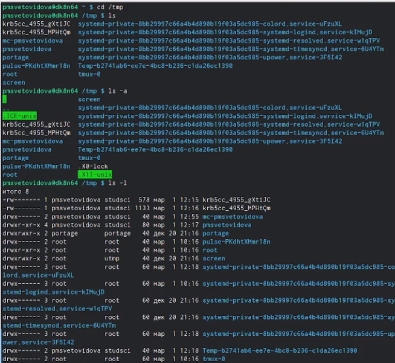
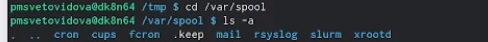
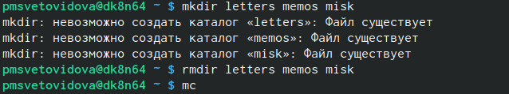
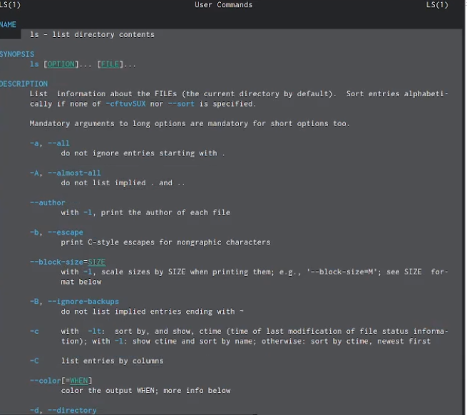
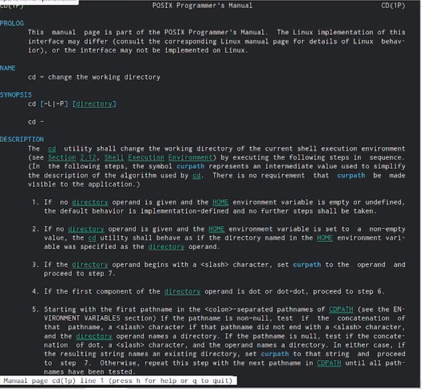
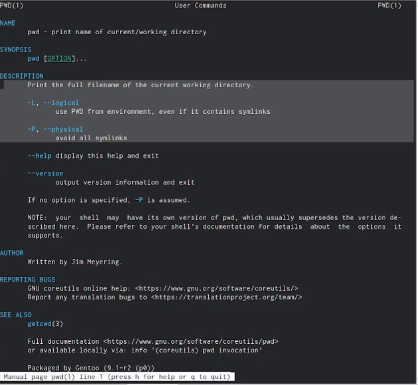
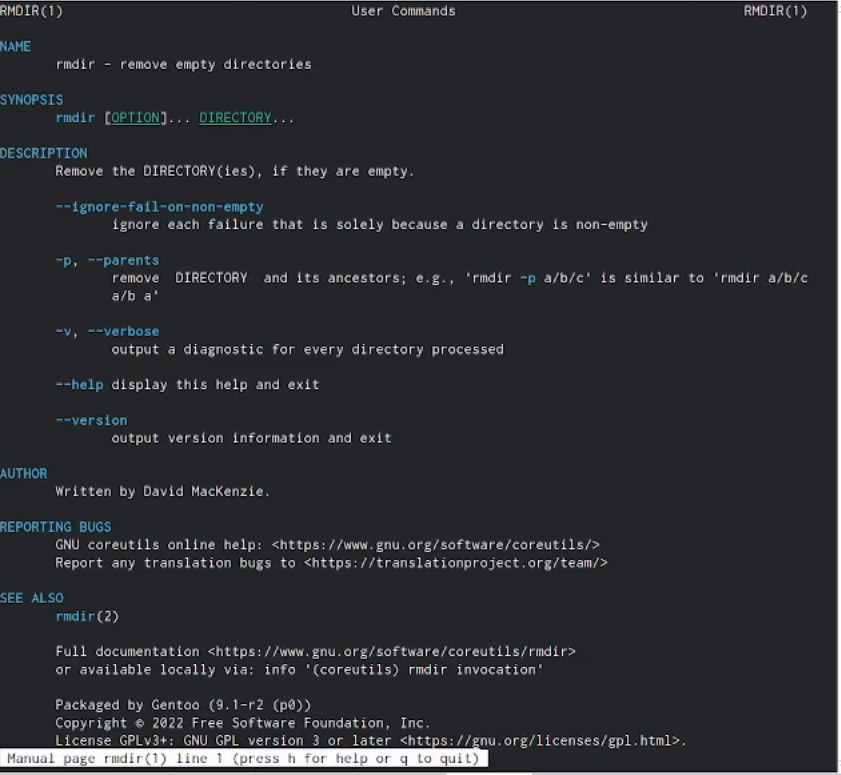
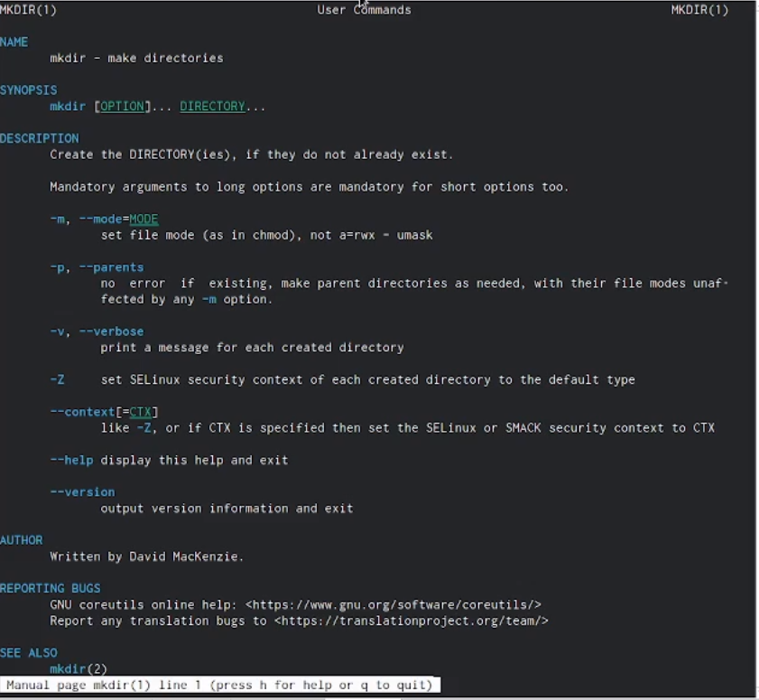

---
## Front matter
lang: ru-RU
title: Работа с командной строкой
author: |
          Световидова П. М.
institute: |
       \inst{1}Российский Университет Дружбы Народов

date: 02 марта, 2023, Москва, Россия
## i18n babel
babel-lang: russian
babel-otherlangs: english

## Formatting pdf
toc: false
toc-title: Содержание
slide_level: 2
aspectratio: 169
section-titles: true
theme: metropolis
header-includes:
 - \metroset{progressbar=frametitle,sectionpage=progressbar,numbering=fraction}
 - '\makeatletter'
 - '\beamer@ignorenonframefalse'
 - '\makeatother'
---

# Информация

## Докладчица

:::::::::::::: {.columns align=center}
::: {.column width="70%"}

  * Световидова Полина Михайловна
  * Студентка НБИбд-04-22
  * Российский университет дружбы народов
  * [1132220827@pfur.ru](mailto:1132220827@pfur.ru)
  * <https://github.com/Pmsvetovidova>

:::
::: {.column width="30%"}
:::
::::::::::::::

# Цель работы

Приобретение практических навыков взаимодействия пользователя с системой посредством командной строки.

# Выполнение лабораторной работы

НАЧАЛО

##

а потом удалю ранее созданый каталог newdir

##

##

Разница в выводимой на экран информации:
Команда ls выводит содержимое каталога.
Команда ls -l выводит подробный список, в котором будет отображаться владелец, группа, дата создания, размер и другие параметры.
Команда ls -F показывает тип объекта.

##

##

С помощью команды man определила, какую опцию команды ls нужно использовать для просмотра содержимого не только указанного каталога, но и подкаталогов, входящих в него.
А именно: -R, --recursive
list subdirectories recursively
  
##
           
С помощью команды man определила набор опций команды ls, позволяющий отсортировать по времени последнего изменения выводимый список содержимого каталога с развёрнутым описанием файлов.
А именно: --time-style=TIME STYLE
-t
-T
-u

##

Использовала команду man для просмотра описания следующих команд: cd, pwd,
mkdir, rmdir. 

##

##

##

##

##

Основные опции этих команд:
cd – команда перемещения по файловой системе.
pwd – команда показывающая директорию, в которой находится пользователь.
mkdir – команда, создающая новую директорию.
rmdir – команда, удаляющая файлы, которые должны быть пустыми.
rm - команда, удаляющая файлы или целые деревья каталогов.

##

Используя информацию, полученную при помощи команды history, выполнила
модификацию и исполнение нескольких команд из буфера команд.
Команда history

##

##

##

пример:
!8
СВ
!8:s/d/b
cb

## Вывод

Мы приобрели практические навыки взаимодействия пользователя с системой посредством командной строки.
