---
## Front matter
title: "Шаблон отчёта по лабораторной работе"
author: "Световидова Полина Михайловна"

## Generic otions
lang: ru-RU
toc-title: "Содержание"

## Bibliography
bibliography: bib/cite.bib
csl: pandoc/csl/gost-r-7-0-5-2008-numeric.csl

## Pdf output format
toc: true # Table of contents
toc-depth: 2
lof: true # List of figures
lot: true # List of tables
fontsize: 12pt
linestretch: 1.5
papersize: a4
documentclass: scrreprt
## I18n polyglossia
polyglossia-lang:
  name: russian
  options:
	- spelling=modern
	- babelshorthands=true
polyglossia-otherlangs:
  name: english
## I18n babel
babel-lang: russian
babel-otherlangs: english
## Fonts
mainfont: PT Serif
romanfont: PT Serif
sansfont: PT Sans
monofont: PT Mono
mainfontoptions: Ligatures=TeX
romanfontoptions: Ligatures=TeX
sansfontoptions: Ligatures=TeX,Scale=MatchLowercase
monofontoptions: Scale=MatchLowercase,Scale=0.9
## Biblatex
biblatex: true
biblio-style: "gost-numeric"
biblatexoptions:
  - parentracker=true
  - backend=biber
  - hyperref=auto
  - language=auto
  - autolang=other*
  - citestyle=gost-numeric
## Misc options
indent: true
header-includes:
  - \usepackage{indentfirst}
  - \usepackage{float} # keep figures where there are in the text
  - \floatplacement{figure}{H} # keep figures where there are in the text
---

# Цель работы

Приобретение практических навыков взаимодействия пользователя с системой по-
средством командной строки.

# Выполнение лабораторной работы

1. Определите полное имя вашего домашнего каталога. Далее относительно этого каталога будут выполняться последующие упражнения. 
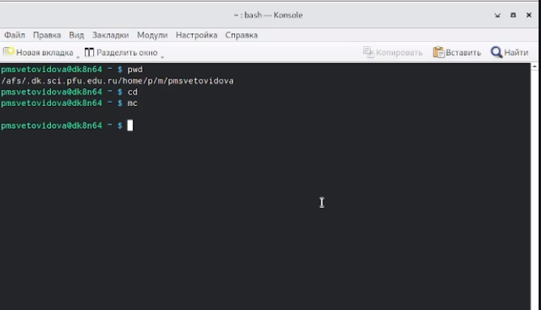{#fig:001 width=70%}(рис1)

2. Выполните следующие действия:

21. Перейдите в каталог /tmp. Выведите на экран содержимое каталога /tmp. Для этого используйте команду ls с различными опциями. Поясните разницу в выводимой на экран информации.
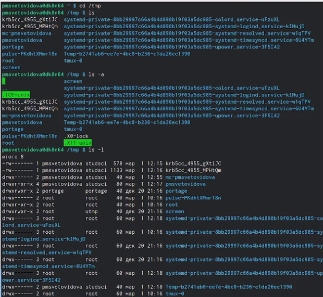{#fig:001 width=70%}(рис2.)

22. Определите, есть ли в каталоге /var/spool подкаталог с именем cron? 
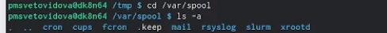{#fig:001 width=70%}(рис3.)

23. Перейдите в Ваш домашний каталог и выведите на экран его содержимое. Определите, кто является владельцем файлов и подкаталогов? 
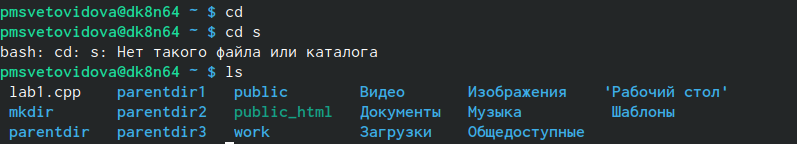{#fig:001 width=70%}(рис4.)

3. Выполните следующие действия:

31. В домашнем каталоге создайте новый каталог с именем newdir.
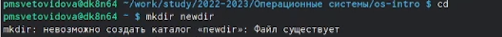{#fig:001 width=70%}(рис5.)

32. В каталоге ~/newdir создайте новый каталог с именем morefun.
{#fig:001 width=70%}(рис6.)

33. В домашнем каталоге создайте одной командой три новых каталога с именами letters, memos, misk. Затем удалите эти каталоги одной командой.
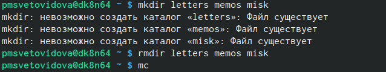{#fig:001 width=70%}(рис7.)

34. Попробуйте удалить ранее созданный каталог ~/newdir командой rm. Проверьте,был ли каталог удалён. 
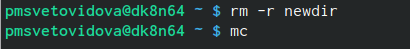{#fig:001 width=70%}(рис8.)

4. С помощью команды man определите, какую опцию команды ls нужно использовать для просмотра содержимое не только указанного каталога, но и подкаталогов,входящих в него.С помощью команды man определите набор опций команды ls, позволяющий отсортировать по времени последнего изменения выводимый список содержимого каталога с развёрнутым описанием файлов.
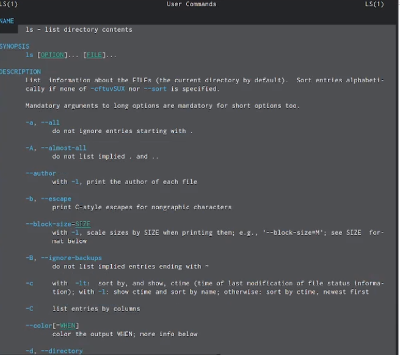{#fig:001 width=70%}(рис9.)

5. Используйте команду man для просмотра описания следующих команд: 

51. cd
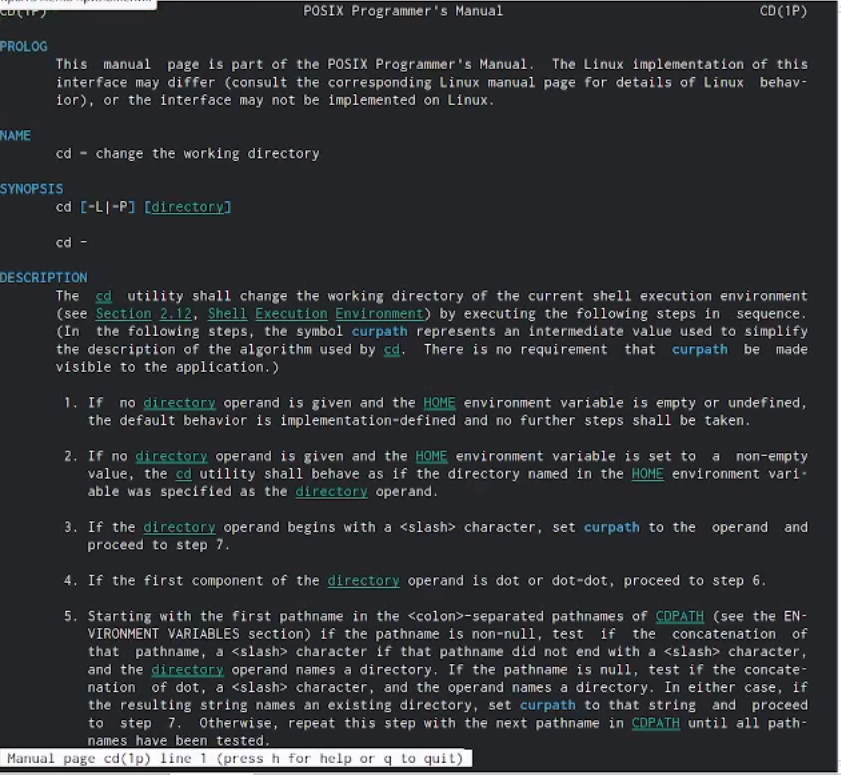{#fig:001 width=70%}(рис10.) 

52. pwd
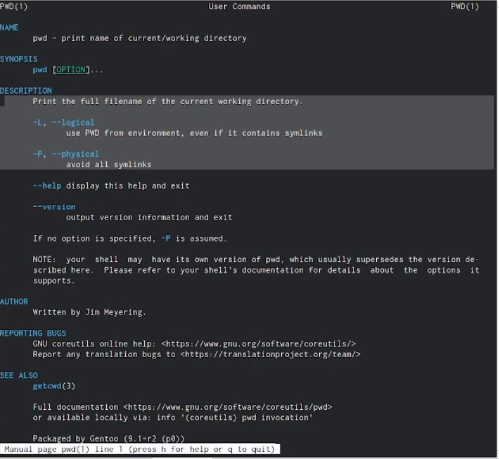{#fig:001 width=70%}(рис11.) 

53. rmdir
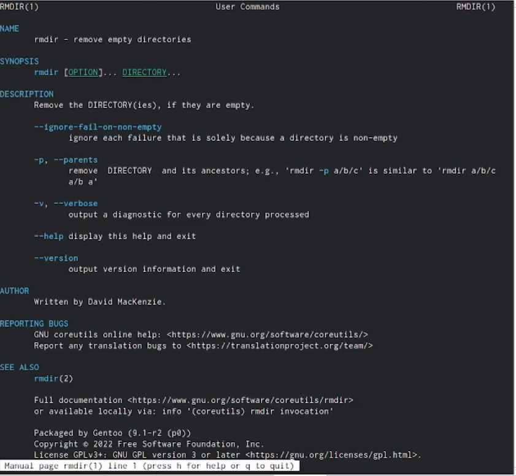{#fig:001 width=70%}(рис12.) 

54. mkdir
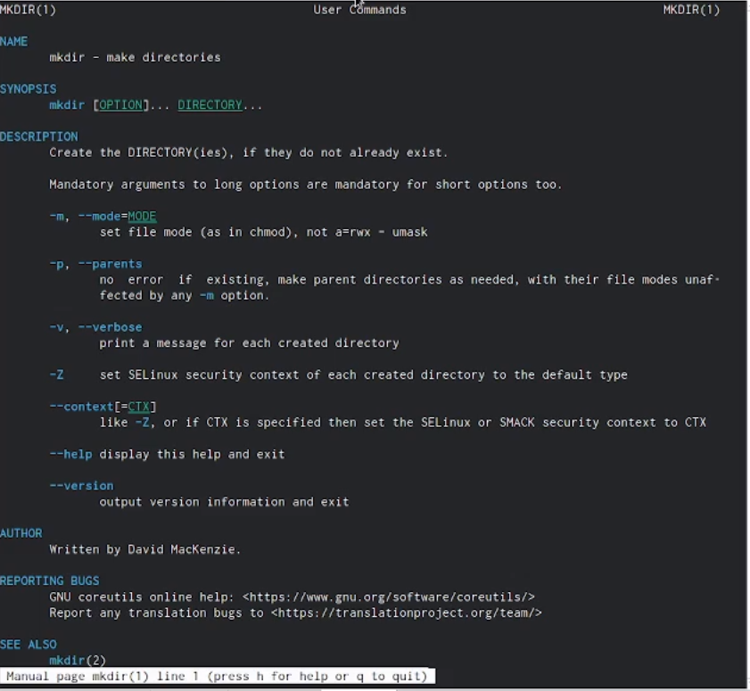{#fig:001 width=70%}(рис13.). 

6. Используя информацию, полученную при помощи команды history, выполните модификацию и исполнение нескольких команд из буфера команд
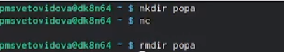{#fig:001 width=70%}(рис14.)

# Выводы

В этой лабораторной работе мы приобрели практические навыки взаимодействия пользователя с системой посредством командной строки.
