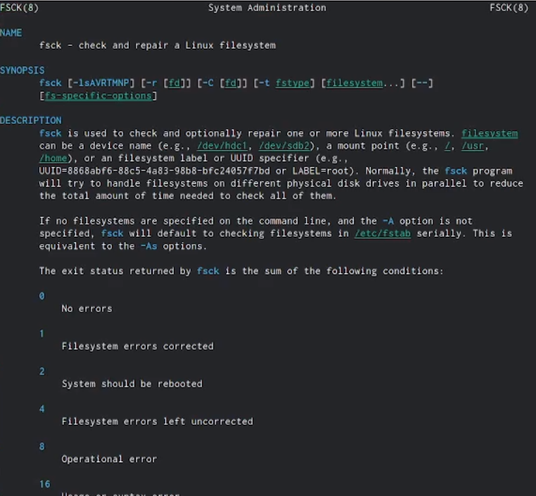

---
## Front matter
lang: ru-RU
title: Файловая система Linux
author: |
	  Световидова Полина НБИбд-04-22\inst{1}

institute: |
	\inst{1}Российский Университет Дружбы Народов

date: 10 марта, 2023, Москва, Россия

## Formatting
mainfont: PT Serif
romanfont: PT Serif
sansfont: PT Sans
monofont: PT Mono
toc: false
slide_level: 2
theme: metropolis
header-includes: 
 - \metroset{progressbar=frametitle,sectionpage=progressbar,numbering=fraction}
 - '\makeatletter'
 - '\beamer@ignorenonframefalse'
 - '\makeatother'
aspectratio: 43
section-titles: true

---

## Цель работы

Ознакомление с файловой системой Linux, её структурой, именами и содержанием
каталогов. Приобретение практических навыков по применению команд для работы
с файлами и каталогами,по управлению процессами (и работами),по проверке использования диска и обслуживанию файловой системы.

## Выполнение лабораторной работы

1.Выполнил все примеры, приведённые в первой части описания лабораторной работы.
Скопировал файл ~/abc1 в файл april и в файл may. Скопировал файлы april и may в каталог monthly. 
Скопировал файл monthly/may в файл с именем june. 
Скопировал каталог monthly в каталог monthly.00.
Скопировал каталог monthly.00 в каталог /tmp

##

##

Изменил название файла april на july в домашнем каталоге. Переместил файл july в каталог monthly.00. Переименовал каталог monthly.00 в monthly.01. Переместил каталог monthly.01в каталог reports. Переименовал каталог reports/monthly.01 в reports/monthly

##

##

Создал файл ~/may с правом выполнения для владельца. Лишил владельца файла ~/may права на выполнение. Создал каталог monthly с запретом на чтение для членов группы и всех остальных пользователей. Создал файл ~/abc1 с правом записи для членов группы.

##

##

Воспользовался командой df, которая выведет на экран список всех файловых
систем в соответствии с именами устройств, с указанием размера и точки монтирования, для определения объёма свободного пространства на файловой системе. С помощью команды fsck проверил целостность файловой системы.

##

2. Выполнил следующие действия, зафиксировав в отчёте по лабораторной работе
используемые при этом команды и результаты их выполнения:
2.1. Скопировал файл /usr/include/sys/io.h в домашний каталог, с помощью команды cp и назвала его equipment, с помощью команды mv. 

2.2. В домашнем каталоге создал директорию ~/ski.plases.

2.3. Переместил файл equipment в каталог ~/ski.plases командой mv.

2.4. Переименовал файл ~/ski.plases/equipment в ~/ski.plases/equiplist командой mv.

2.5. Создал в домашнем каталоге файл abc1 и скопировал его в каталог ~/ski.plases командой cp, назвал его equiplist2 командой mv.

##

2.6. Создал каталог с именем equipment в каталоге ~/ski.plases командой mkdir.

2.7. Переместил файлы ~/ski.plases/equiplist и equiplist2 в каталог ~/ski.plases/equipment командой mv.

2.8. Создал и переместил каталог ~/newdir в каталог ~/ski.plases командами mkdir и  mv и назвал его plans командой mv. 

##

##

3. Определил опции команды chmod, необходимые для того, чтобы присвоить перечисленным ниже файлам выделенные права доступа, считая, что в начале таких прав нет. При необходимости создал нужные файлы.

##

3.1. drwxr--r-- ... australia

##

##

3.2. drwx--x--x ... play

##

3.4. -rw-rw-r-- ... feathers

##

4. Проделал приведённые ниже упражнения, записывая в отчёт по лабораторной
работе используемые при этом команды:

4.1. Не просмотрел содержимое файла /etc/password, так как у меня его нет.

4.2. Скопировал файл ~/feathers в файл ~/file.old командой cp.

##

4.3. Переместил файл ~/file.old в каталог ~/play командой mv.

4.4. Скопировал каталог ~/play в каталог ~/fun командой cp -r.

4.5. Переместил каталог ~/fun в каталог ~/play командой mv и назвал его games командой mv.

##

4.6. Лишил владельца файла ~/feathers права на чтение командой chmod u-r.

4.7. Если попытаться скопировать файл ~/feathers командой cp, то выведется:

4.8. Дал владельцу файла ~/feathers право на чтение командой chmod u+r.

##

4.9. Лишилавладельца каталога ~/play права на выполнение командой chmod u-x.

4.10. Попытался перейти в каталог ~/play командой cd. 

4.11. Дал владельцу каталога ~/play право на выполнение командой chmod u+x. 

##

##

5. Прочитал man по командам mount, fsck, mkfs, kill.

##

# mount

##

# fsck

##

# mkfs

 
##
 
# kill

##

# Краткая характеристика:
- mount применяется для монтирования файловых систем.
- fsck восстанавливает повреждённую файловую систему или проверяет на целостность.
- mkfs создаёт новую файловую систему.
- kill используется для принудительного завершения работы приложений.

## Выводы

Ознакомился с файловой системой Linux, её структурой, именами и содержанием каталогов. Приобрел практические навыки по применению команд для работы с файлами и каталогами, по управлению процессами (и работами), по проверке использования диска и обслуживанию файловой системы.

