---
## Front matter
title: "Лабораторная работа-05"
subtitle: "Файловая система Linux"
author: "Световидова Полина НБИбд-04-22"

## Generic otions
lang: ru-RU
toc-title: "Содержание"

## Bibliography
bibliography: bib/cite.bib
csl: pandoc/csl/gost-r-7-0-5-2008-numeric.csl

## Pdf output format
toc: true # Table of contents
toc-depth: 2
lof: true # List of figures
lot: true # List of tables
fontsize: 12pt
linestretch: 1.5
papersize: a4
documentclass: scrreprt
## I18n polyglossia
polyglossia-lang:
  name: russian
  options:
	- spelling=modern
	- babelshorthands=true
polyglossia-otherlangs:
  name: english
## I18n babel
babel-lang: russian
babel-otherlangs: english
## Fonts
mainfont: PT Serif
romanfont: PT Serif
sansfont: PT Sans
monofont: PT Mono
mainfontoptions: Ligatures=TeX
romanfontoptions: Ligatures=TeX
sansfontoptions: Ligatures=TeX,Scale=MatchLowercase
monofontoptions: Scale=MatchLowercase,Scale=0.9
## Biblatex
biblatex: true
biblio-style: "gost-numeric"
biblatexoptions:
  - parentracker=true
  - backend=biber
  - hyperref=auto
  - language=auto
  - autolang=other*
  - citestyle=gost-numeric
## Pandoc-crossref LaTeX customization
figureTitle: "Рис."
tableTitle: "Таблица"
listingTitle: "Листинг"
lofTitle: "Список иллюстраций"
lotTitle: "Список таблиц"
lolTitle: "Листинги"
## Misc options
indent: true
header-includes:
  - \usepackage{indentfirst}
  - \usepackage{float} # keep figures where there are in the text
  - \floatplacement{figure}{H} # keep figures where there are in the text
---

# Цель работы

Ознакомление с файловой системой Linux, её структурой, именами и содержанием
каталогов. Приобретение практических навыков по применению команд для работы
с файлами и каталогами,по управлению процессами (и работами),по проверке использования диска и обслуживанию файловой системы.

# Задание

1. Выполните все примеры,приведённые в первой части описаниял абораторной работы.
2. Выполните следующие действия, зафиксировав в отчёте по лабораторной работе используемые при этом команды и результаты их выполнения:
2.1. Скопируйте файл '/usr/include/sys/io.h' в домашний каталоги назовите его equipment.Если файла io.h нет,то используйтелюбойдругой файл в каталоге
/usr/include/sys/ вместо него.
2.2. В домашнем каталоге создайте директорию ~/ski.plases.
2.3. Переместите файл equipment в каталог ~/ski.plases.
2.4. Переименуйте файл ~/ski.plases/equipment в ~/ski.plases/equiplist.
2.5. Создайте в домашнем каталоге файл abc1 и скопируйте его в каталог
'~/ski.plases,назовите его equiplist2'.
2.6. Создайте каталог с именем equipment в каталоге ~/ski.plases.
2.7. Переместите файлы ~/ski.plases/equiplist и equiplist2 в каталог
~/ski.plases/equipment.
2.8. Создайте и переместите каталог '~/newdir' в каталог '~/ski.plases' и назовите
его plans.
3. Определите опции команды chmod,необходимые длятого,чтобы присвоить перечис-
ленным ниже файлам выделенные права доступа, считая, что в начале таких прав
нет:
3.1. drwxr--r-- ... australia
3.2. drwx--x--x ... play
3.3. -r-xr--r-- ... my_os
3.4. -rw-rw-r-- ... feathers
При необходимости создайте нужные файлы.
4. Проделайте приведённые ниже упражнения, записывая в отчёт по лабораторной
работе используемые при этом команды:
4.1. Просмотрите содержимое файла /etc/password.
4.2. Скопируйте файл ~/feathers в файл ~/file.old.
4.3. Переместите файл ~/file.old в каталог ~/play.
4.4. Скопируйте каталог ~/play в каталог ~/fun.
4.5. Переместите каталог ~/fun в каталог ~/play и назовите его games.
4.6. Лишите владельца файла ~/feathers права на чтение.
4.7. Что произойдёт,если вы попытаетесь просмотреть файл ~/feathers командой
cat?
4.8. Что произойдёт,если вы попытаетесь скопировать файл ~/feathers?
4.9. Дайте владельцу файла ~/feathers право на чтение.
4.10. Лишите владельца каталога ~/play права на выполнение.
4.11. Перейдите в каталог ~/play.Что произошло?
4.12. Дайте владельцу каталога ~/play право на выполнение.
5. Прочитайте man по командам mount,fsck,mkfs,kill и кратко их охарактеризуйте,
приведя примеры.

# Выполнение лабораторной работы

1.Выполнил все примеры, приведённые в первой части описания лабораторной работы.
Скопировал файл ~/abc1 в файл april и в файл may. Скопировал файлы april и may в каталог monthly. 
Скопировал файл monthly/may в файл с именем june. 
Скопировал каталог monthly в каталог monthly.00.
Скопировал каталог monthly.00 в каталог /tmp (см.рис. [-@fig:001])

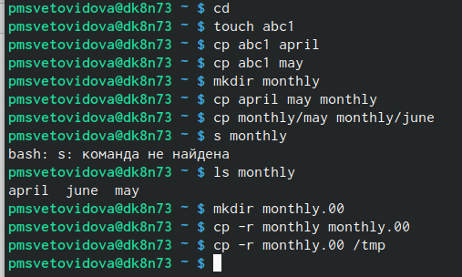{ #fig:001 width=70% }

Изменил название файла april на july в домашнем каталоге. Переместил файл july в каталог monthly.00. Переименовал каталог monthly.00 в monthly.01. Переместил каталог monthly.01в каталог reports. Переименовал каталог reports/monthly.01 в reports/monthly (см.рис. [-@fig:002]).

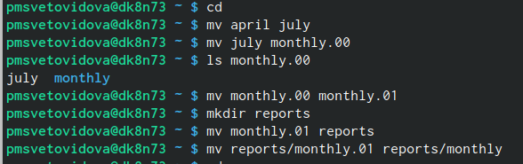{ #fig:002 width=70% }

Создал файл ~/may с правом выполнения для владельца. Лишил владельца файла ~/may права на выполнение. Создал каталог monthly с запретом на чтение для членов группы и всех остальных пользователей. Создал файл ~/abc1 с правом записи для членов группы.(см.рис. [-@fig:003])(см.рис. [-@fig:004])

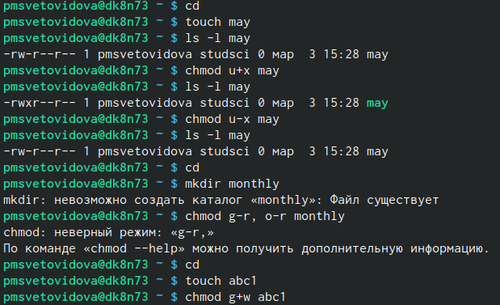{ #fig:003 width=70% }
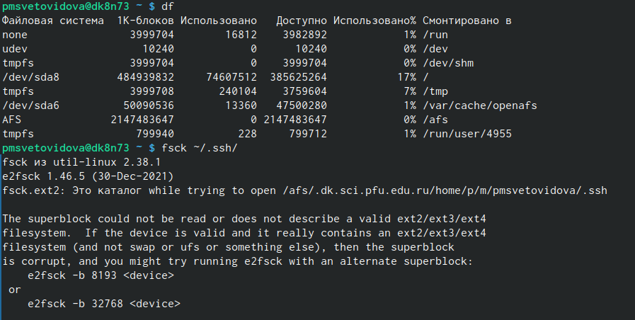{ #fig:004 width=70% }

Воспользовался командой df, которая выведет на экран список всех файловых
систем в соответствии с именами устройств, с указанием размера и точки монтирования, для определения объёма свободного пространства на файловой системе. С помощью команды fsck проверил целостность файловой системы.(см.рис. [-@fig:005])

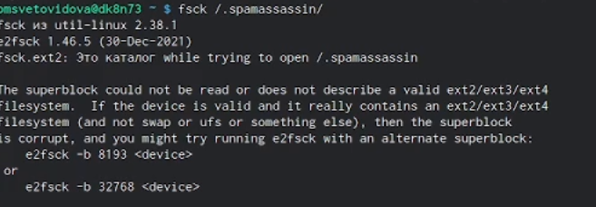{ #fig:005 width=70% }

2. Выполнил следующие действия, зафиксировав в отчёте по лабораторной работе
используемые при этом команды и результаты их выполнения:
2.1. Скопировал файл /usr/include/sys/io.h в домашний каталог, с помощью команды cp и назвала его equipment, с помощью команды mv. 

2.2. В домашнем каталоге создал директорию ~/ski.plases.

2.3. Переместил файл equipment в каталог ~/ski.plases командой mv.

2.4. Переименовал файл ~/ski.plases/equipment в ~/ski.plases/equiplist командой mv.

2.5. Создал в домашнем каталоге файл abc1 и скопировал его в каталог ~/ski.plases командой cp, назвал его equiplist2 командой mv.

2.6. Создал каталог с именем equipment в каталоге ~/ski.plases командой mkdir.

2.7. Переместил файлы ~/ski.plases/equiplist и equiplist2 в каталог ~/ski.plases/equipment командой mv.

2.8. Создал и переместил каталог ~/newdir в каталог ~/ski.plases командами mkdir и  mv и назвал его plans командой mv. (см.рис. [-@fig:006])(см.рис. [-@fig:007])

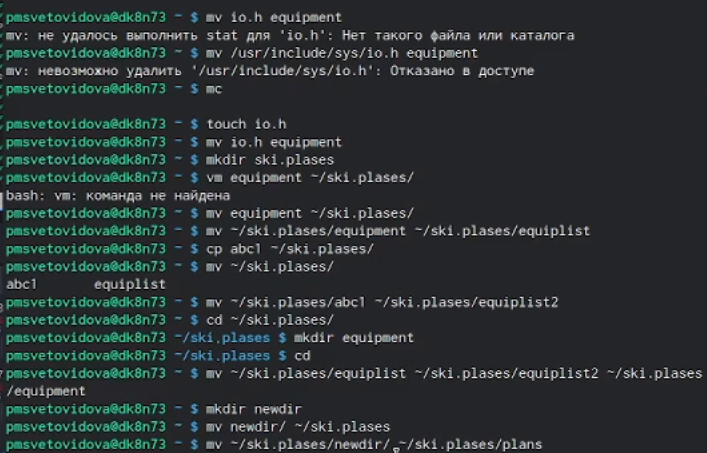{ #fig:006 width=70% }

3. Определил опции команды chmod, необходимые для того, чтобы присвоить перечисленным ниже файлам выделенные права доступа, считая, что в начале таких прав нет. При необходимости создал нужные файлы.(см.рис. [-@fig:008])
(см.рис. [-@fig:009])(см.рис. [-@fig:010])(см.рис. [-@fig:011])(см.рис. [-@fig:012])

3.1. drwxr--r-- ... australia

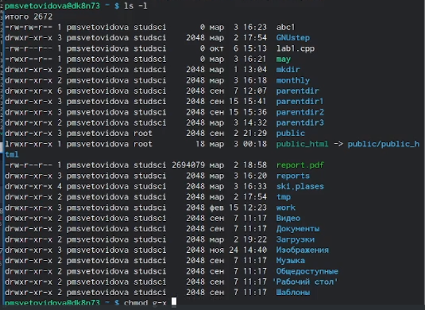{ #fig:008 width=70% }

{ #fig:009 width=70% }

3.2. drwx--x--x ... play
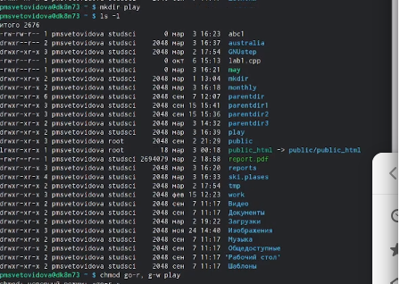{ #fig:011 width=70% }

3.3. -r-xr--r-- ... my_os

3.4. -rw-rw-r-- ... feathers

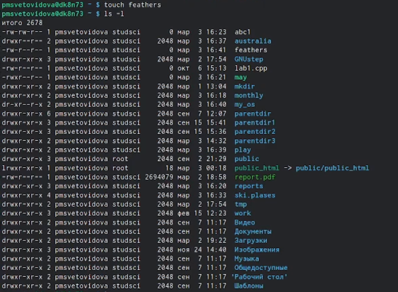{ #fig:012 width=70% }

4. Проделал приведённые ниже упражнения, записывая в отчёт по лабораторной
работе используемые при этом команды:(см.рис. [-@fig:013])

4.1. Не просмотрел содержимое файла /etc/password, так как у меня его нет.

4.2. Скопировал файл ~/feathers в файл ~/file.old командой cp.

4.3. Переместил файл ~/file.old в каталог ~/play командой mv.

4.4. Скопировал каталог ~/play в каталог ~/fun командой cp -r.

4.5. Переместил каталог ~/fun в каталог ~/play командой mv и назвал его games командой mv.

4.6. Лишил владельца файла ~/feathers права на чтение командой chmod u-r.

4.7. Если попытаться скопировать файл ~/feathers командой cp, то выведется:

4.8. Дал владельцу файла ~/feathers право на чтение командой chmod u+r.

4.9. Лишилавладельца каталога ~/play права на выполнение командой chmod u-x.

4.10. Попытался перейти в каталог ~/play командой cd. 

4.11. Дал владельцу каталога ~/play право на выполнение командой chmod u+x. 

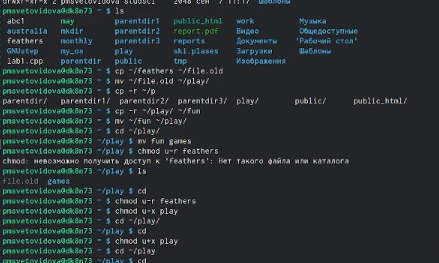{ #fig:013 width=70% }

5. Прочитал man по командам mount, fsck, mkfs, kill.(см.рис. [-@fig:018])(см.рис. [-@fig:024])(см.рис. [-@fig:027])(см.рис. [-@fig:028])

mount

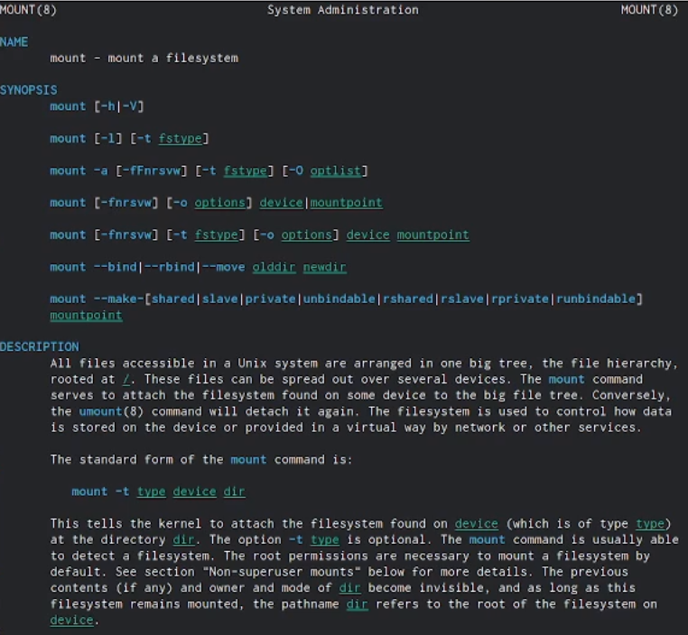{ #fig:018 width=70% }

fsck

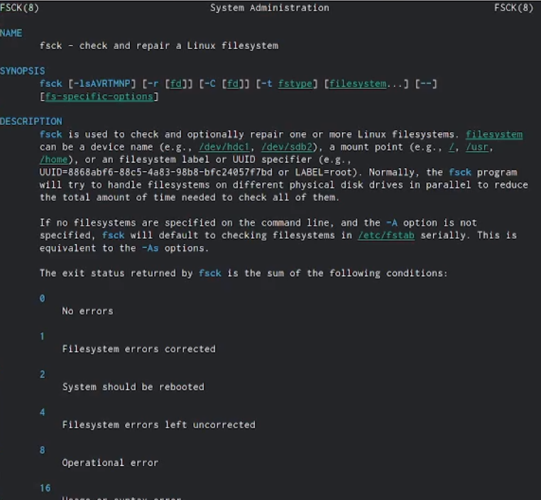{ #fig:024 width=70% }

mkfs(см.рис. [-@fig:024])

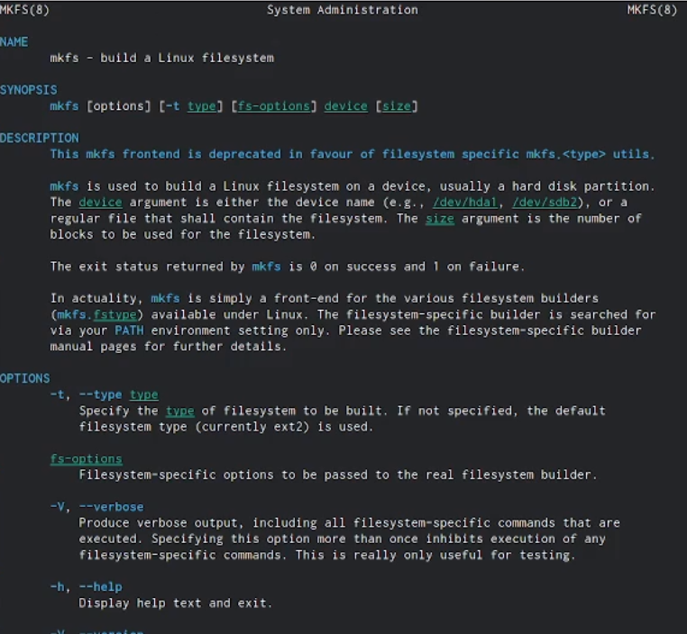{ #fig:027 width=70% }
 
kill(см.рис. [-@fig:025])(см.рис. [-@fig:026])(см.рис. [-@fig:027])

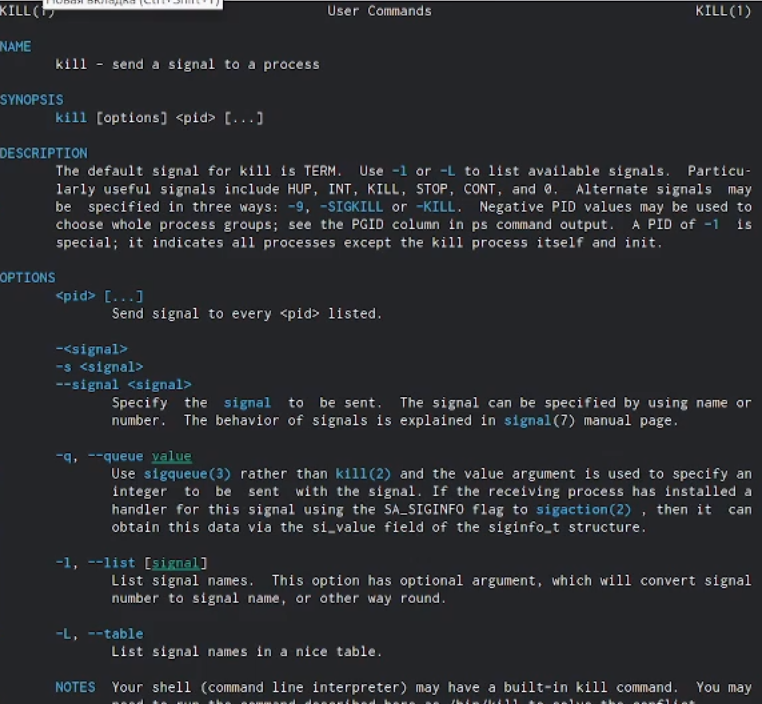{ #fig:028 width=70% }

Краткая характеристика:
- mount применяется для монтирования файловых систем.
- fsck восстанавливает повреждённую файловую систему или проверяет на целостность.
- mkfs создаёт новую файловую систему.
- kill используется для принудительного завершения работы приложений.

# Выводы

Ознакомился с файловой системой Linux, её структурой, именами и содержанием каталогов. Приобрел практические навыки по применению команд для работы с файлами и каталогами, по управлению процессами (и работами), по проверке использования диска и обслуживанию файловой системы.

# Ответы на контрольные вопросы:

1.Характеристика файловой системы, которая использовалась в данной лабораторной работе:
Файлы: abc1, april, may, june, july, isdv4.h, equipment, equiplist, equiplist2, my_os, feathers, file.old.
Каталоги: monthly, monthly.00, tmp, monthly.01, reports, usr, ski.plases, equipment, newdir, plans, australia, play, etc, fun, games.

2.Пример общей структуры файловой системы: /home/pdarzhankina/monthly/april, где /home/pdarzhankina – домашний каталог, /monthly – каталог, находящийся в домашнем и содержащий файл, /аpril – файл, находящийся в каталоге.

3. Чтобы содержимое некоторой файловой системы было доступно операционной системе должно быть выполнено монтирование тома.

4. Основные причины нарушения целостности файловой системы:
- Один блок адресуется несколькими mode (принадлежит нескольким файлам).
- Блок помечен как свободный, но в то же время занят (на него ссылается onode).
- Блок помечен как занятый, но в то же время свободен (ни один inode на него не ссылается).
- Неправильное число ссылок в inode (недостаток или избыток ссылающихся записей в каталогах).
- Несовпадение между размером файла и суммарным размером адресуемых inode блоков.
- Недопустимые адресуемые блоки (например, расположенные за пределами файловой системы).
- "Потерянные" файлы (правильные inode, на которые не ссылаются записи каталогов).
- Недопустимые или неразмещенные номера inode в записях каталогов.
Чтобы устранить повреждения файловой системы используется команда fsck.

5. Команда mkfs создаёт новую файловую систему.

6. Характеристика команд, которые позволяют просмотреть текстовые файлы:
- для просмотра небольших файлов удобно пользоваться командой cat.
- для просмотра больших файлов используйте команду less — она позволяет осуществлять постраничный просмотр файлов.
- для просмотра начала файла можно воспользоваться командой head, по умолчанию она выводит первые 10 строк файла.
- команда tail выводит несколько (по умолчанию 10) последних строк файла.
7. Основные возможности команды cp:
- копирование файла в текущем каталоге.
- копирование нескольких файлов в каталог.
- копирование файлов в произвольном каталоге.
Опция i в команде cp выведет на экран запрос подтверждения о перезаписи файла, если на место целевого файла вы поставите имя уже существующего файла.
Команда cp с опцией r (recursive) позволяет копировать каталоги вместе с входящими в них файлами и каталогами.

8. Характеристика команд перемещения и переименования файлов и каталогов:
- переименование файлов в текущем каталоге.
mv <старое_название_файла> <новое_название_файла> 
- перемещение файлов в другой каталог.
mv <название_файла> <название_каталога> 
Если необходим запрос подтверждения о перезаписи файла, то нужно использовать опцию i.
- переименование каталогов в текущем каталоге.
mv <старое_название_каталога> <новое_название_каталога> 
- перемещение каталога в другой каталог.
mv <старый_каталога> <новый_каталог> 
- переименование каталога, не являющегося текущим.
mv <каталог/старое_название_каталога> < каталог/новое_название_каталога> 

9. Каждый файл или каталог имеет права доступа: чтение (разрешены просмотр и копирование файла, разрешён просмотр списка входящих в каталог файлов), запись (разрешены изменение и переименование файла, разрешены создание и удаление файлов каталога), выполнение (разрешено выполнение файла, разрешён доступ в
каталог и есть возможность сделать его текущим). Они могу быть изменены командой chmod.

# Список литературы{.unnumbered}

::: {#refs}
:::

1. [Лаб-05] 

