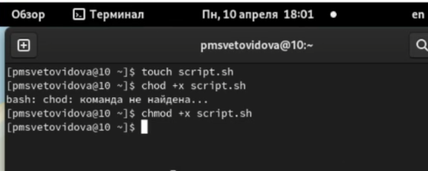
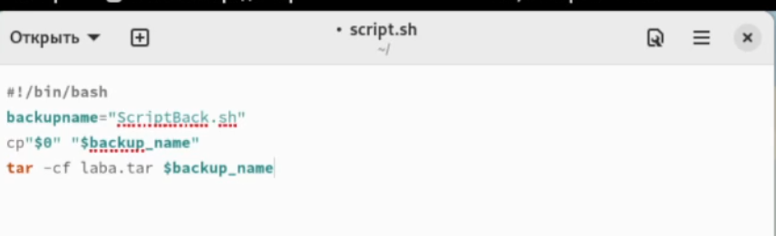
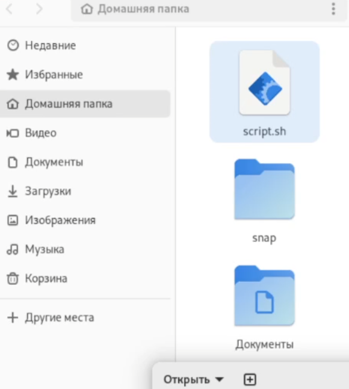
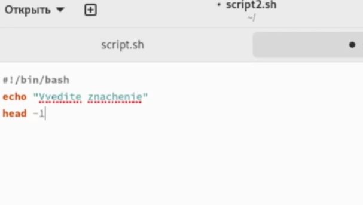
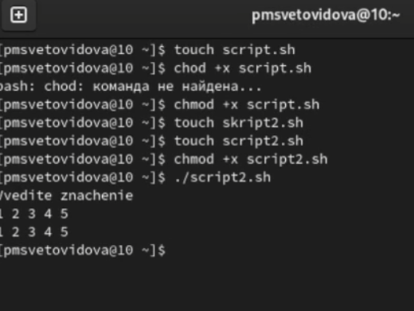
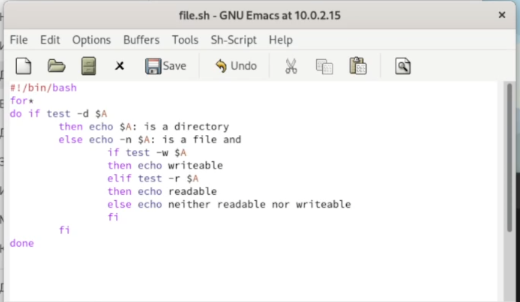
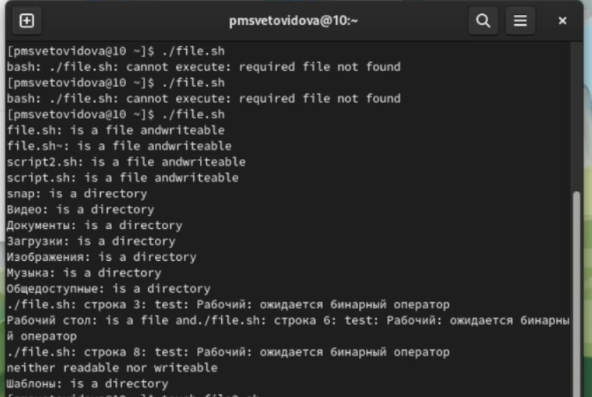
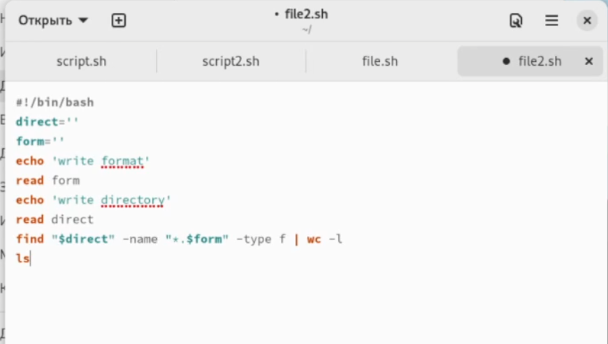
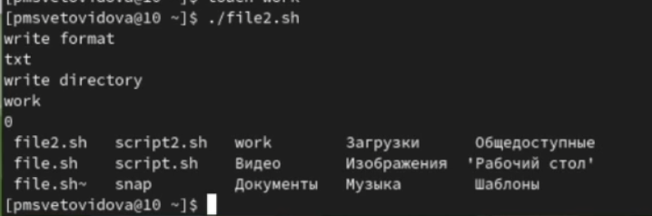

---
## Front matter
lang: ru-RU
title: Программирование в командном процессоре ОС UNIX
author: Световидова Полина НБИбд-04-22
institute: Российский Университет Дружбы Народов
date: 10 апреля, 2023, Москва, Россия

## Formatting
mainfont: PT Serif
romanfont: PT Serif
sansfont: PT Sans
monofont: PT Mono
toc: false
slide_level: 2
theme: metropolis
header-includes: 
 - \metroset{progressbar=frametitle,sectionpage=progressbar,numbering=fraction}
 - '\makeatletter'
 - '\beamer@ignorenonframefalse'
 - '\makeatother'
aspectratio: 43
section-titles: true

---

## Цель работы: 

Изучить основы программирования в оболочке ОС UNIX/Linux, научиться писать небольшие командные файлы.

## Ход работы:

1.Написала скрипт, который при запуске будет делать резервную копию самого себя в другую директорию backup в домашнем каталоге. При этом файл должен архивироваться одним из архиваторов на выбор zip, bzip2 или tar. Способ использования команд архивации узнала, изучив справку.

##

##

##

##

2.Написала пример командного файла, обрабатывающего любое произвольное
число аргументов командной строки, в том числе превышающее десять. Например, скрипт может последовательно распечатывать значения всех переданных
аргументов.

##

##

##

3.Написала командный файл — аналог команды ls (без использования самой этой
команды и команды dir). Требуется, чтобы он выдавал информацию о нужном
каталоге и выводил информацию о возможностях доступа к файлам этого каталога.

##

##

##

4.Написала командный файл, который получает в качестве аргумента командной
строки формат файла (.txt, .doc, .jpg, .pdf и т.д.) и вычисляет количество
таких файлов в указанной директории. Путь к директории также передаётся в
виде аргумента командной строки.

##

##

## Вывод:

Изучила основы программирования в оболочке ОС UNIX/Linux, научилась писать небольшие командные файлы

