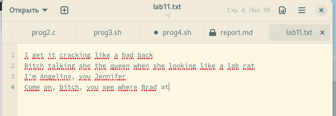
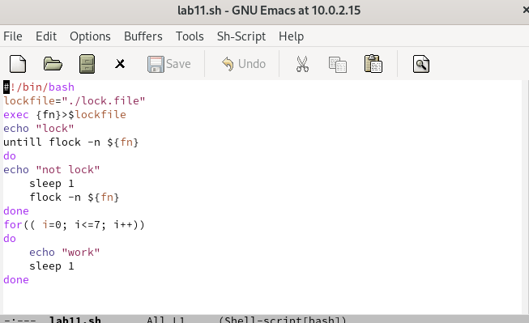
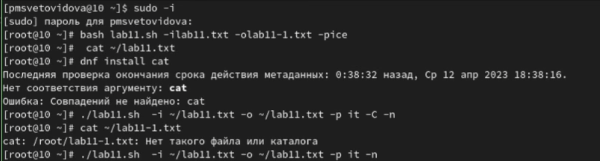
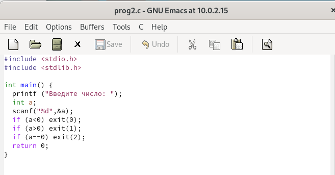
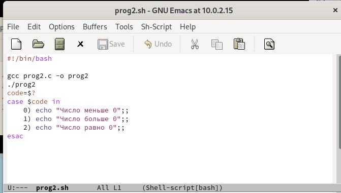
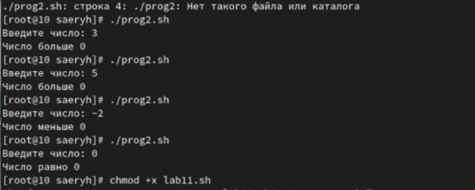
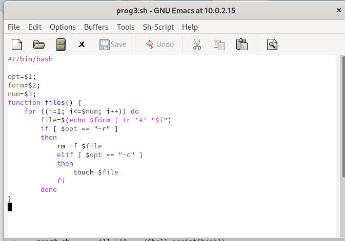
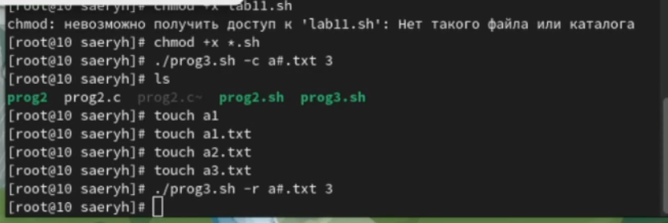
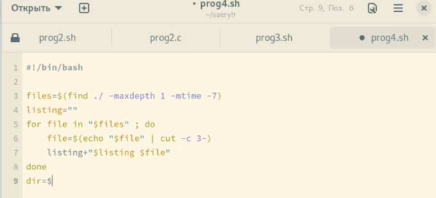
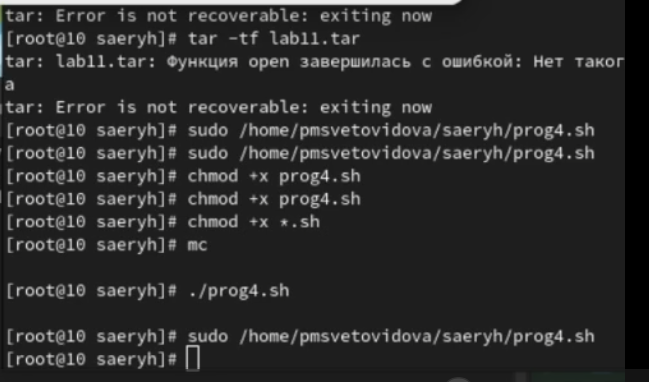

---
## Front matter
lang: ru-RU
title:  Программирование в командномпроцессоре ОС UNIX. Ветвления и циклы
author: Световидова Полина НБИбд-04-22
institute: Российский Университет Дружбы Народов

## Formatting
toc: false
slide_level: 2
theme: metropolis
header-includes: 
 - \metroset{progressbar=frametitle,sectionpage=progressbar,numbering=fraction}
 - '\makeatletter'
 - '\beamer@ignorenonframefalse'
 - '\makeatother'
aspectratio: 43
section-titles: true
---

# Цель работы

Изучить основы программирования в оболочке ОС UNIX. Научится писать болеесложные командные файлы с использованиемлогических управляющих конструкцийи циклов.

# Выполнение лабораторной работы

Используя команды getopts grep, написала командный файл, который анализирует командную строку с ключами:
- -iinputfile — прочитать данные из указанного файла;
- -ooutputfile — вывести данные в указанный файл;
- -pшаблон — указать шаблон для поиска;
- -C—различать большие и малые буквы;
- -n—выдавать номера строк.

##

а затем ищет в указанном файле нужные строки, определяемые ключом -p.(рис. [-@fig:001])(рис. [-@fig:002])(рис. [-@fig:003])

##

{ #fig:001 width=70% }

##

{ #fig:002 width=70% }

##

{ #fig:003 width=70% }

##

Написала на языке Си программу, которая вводит число и определяет, является ли оно больше нуля, меньше нуля или равно нулю. Затем программа завершается с помощью функции exit(n), передавая информацию в о коде завершения в оболочку. Командный файл должен вызывать эту программу и, проанализировав с помощью команды $?, выдать сообщение о том, какое число было введено.(рис. [-@fig:004])(рис. [-@fig:005])(рис. [-@fig:006])

##

{ #fig:004 width=70% }

##

{ #fig:005 width=70% }

##

{ #fig:006 width=70% }

##

Написала командный файл, создающий указанное число файлов, пронумерованных последовательно от 1 до N (например 1.tmp, 2.tmp, 3.tmp, 4.tmp и т.д.). Число файлов, которые необходимо создать, передаётся в аргументы командной строки. Этот же командный файл должен уметь удалять все созданные им файлы (если они существуют).(рис. [-@fig:007])(рис. [-@fig:008])
 
##

{ #fig:007 width=70% }

##

{ #fig:008 width=70% }

##

Написала командный файл, который с помощью команды tar запаковывает в архив все файлы в указанной директории. Модифицировала его так, чтобы запаковывались только те файлы, которые были изменены менее недели тому назад (использовал команду find).(рис. [-@fig:009])(рис. [-@fig:010])

##

{ #fig:009 width=70% }

##

{ #fig:010 width=70% }

# Выводы

В ходе выполнения лабораторной работы №11 я изучила основы программирования в оболочке ОС Linux, а так же научилась писать более сложные командные файлы с использованием логических управляющих конструкций и циклов

