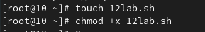
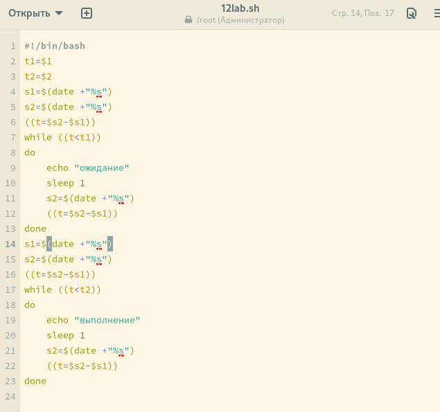
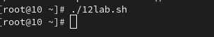
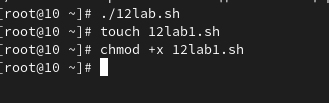
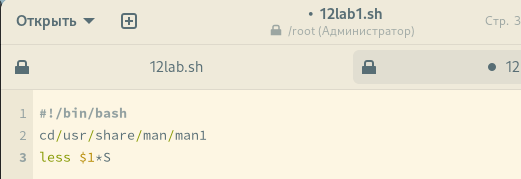
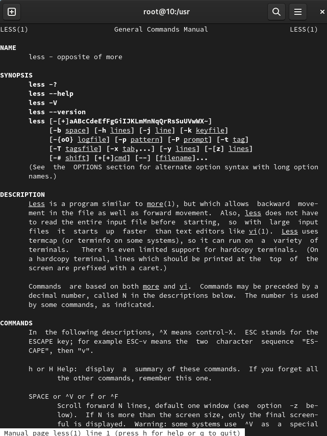
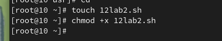
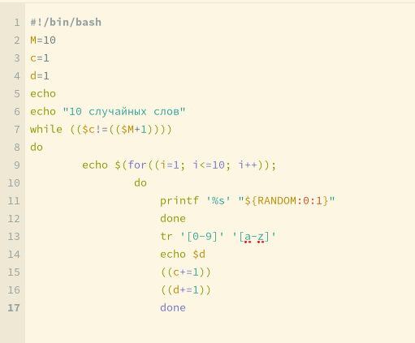
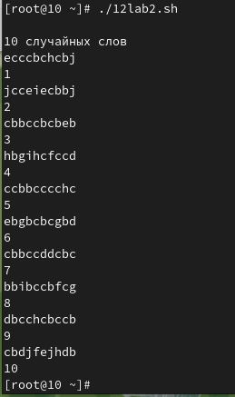

---
## Front matter
lang: ru-RU
title: Программирование в командном процессоре ОС UNIX. Расширенное программирование
author: Световидова Полина НБИбд-04-22

institute: Российский Университет Дружбы Народов

date: 26 апреля, 2023, Москва, Россия

## Formatting
mainfont: PT Serif
romanfont: PT Serif
sansfont: PT Sans
monofont: PT Mono
toc: false
slide_level: 2
theme: metropolis
header-includes: 
 - \metroset{progressbar=frametitle,sectionpage=progressbar,numbering=fraction}
 - '\makeatletter'
 - '\beamer@ignorenonframefalse'
 - '\makeatother'
aspectratio: 43
section-titles: true

---

# Цель работы

Изучить основы программирования в оболочке ОС UNIX. Научиться писать болеесложные командные файлы с использованиемлогических управляющих конструкцийи циклов

# Задание

1. Написать командный файл, реализующий упрощённый механизм семафоров. Командный файл должен втечение некоторого времени t1 дожидаться освобождения ресурса,выдавая об этом сообщение,а дождавшись его освобождения,использовать его в течение некоторого времени t2<>t1, также выдавая информацию о том, что ресурс используется соответствующим командным файлом (процессом).Запустить командный файл в одном виртуальном терминале в фоновом режиме,перенаправив его вывод в другой (> /dev/tty#,где # —номер терминала куда перенаправляется вывод),в котором также запущен этот файл,но не фоновом,а в привилегированном режиме.Доработать программу так,чтобы имелась возможность взаимодействия трёх и более процессов.
2. Реализовать команду man с помощью командного файла.Изучите содержимое каталога /usr/share/man/man1.В нем находятся архивы текстовых файлов,содержащих справку по большинству установленных в системе программ и команд. Каждый архив можно открыть командой less сразу же просмотрев содержимое справки. Командный файл должен получать в виде аргумента командной строки название команды и в виде результата выдавать справку об этой команде или сообщение об отсутствии справки,если соответствующего файла нет в каталоге man1.
3. Используя встроенную переменную $RANDOM,напишите командный файл,генерирующий случайную последовательность букв латинского алфавита.Учтите,что $RANDOM выдаёт псевдо случайные числа в диапазоне от 0 до 32767.

# Выполнение лабораторной работы

Создаю файл для выполнения работы и написания кода

##

##

написание кода по заданию в emacs

##

##

проверяю написанную мной программу

##

##

создаю новый файл для реализации команды man 

##

##

пишу сам код для реализации задумки

##

##

проверяю новую программу на работу

##

##

##

создаю новый текстовый файл и делаю его исполняемым

##

##

пишу код, генерирующий случайную последовательность букв латинского алфавита 

##

##

проверяю программу на работу

##

##

# Выводы

В ходе выполнения лабораторной работы №12 я изучила основы программирования в оболочке ОС Linux, а так же научилась писать более сложные командные файлы с использованием логических управляющих конструкций и циклов

