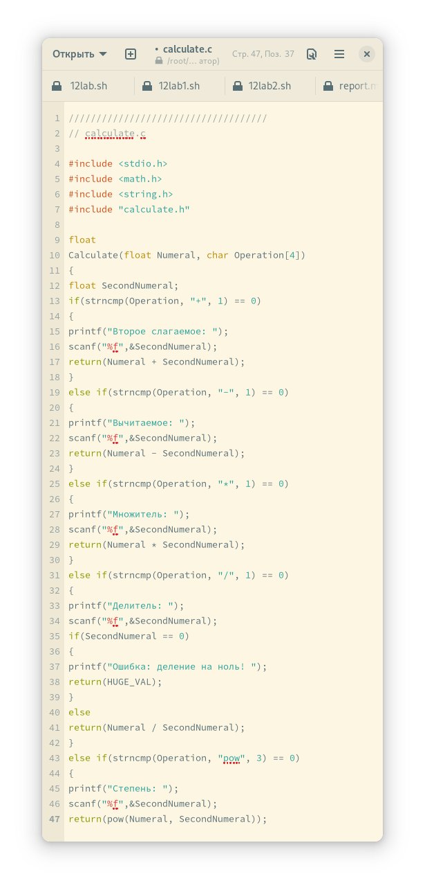
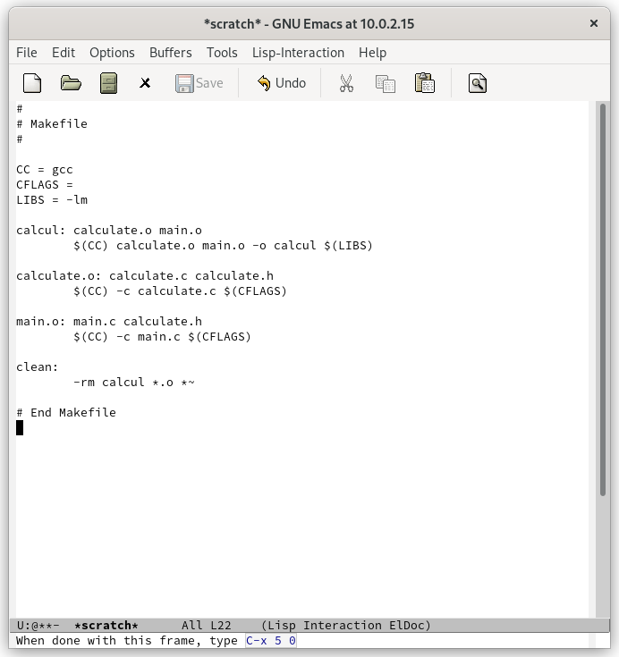

---
## Front matter
lang: ru-RU
title: Средства, применяемые при разработке программного обеспечения в ОС типа UNIX/Linux
author: |
	Световидова Полина Михайловна
institute: |
	Российский Университет Дружбы Народов

## Formatting
toc: false
slide_level: 2
theme: metropolis
header-includes: 
 - \metroset{progressbar=frametitle,sectionpage=progressbar,numbering=fraction}
 - '\makeatletter'
 - '\beamer@ignorenonframefalse'
 - '\makeatother'
aspectratio: 43
section-titles: true
---

# Цель работы

Приобрести простейшие навыки разработки, анализа, тестирования и отладки приложений в ОС типа UNIX/Linux на примере создания на языке программирования С калькулятора с простейшими функциями.

# Выполнение лабораторной работы

В домашнем каталоге создаю подкаталог ~/work/os/lab_prog.

##

##

Создаю в нём файлы calculate.h, calculate.c и main.c

##

##

Реализация функций калькулятора в файле calculate.h

##

##

Интерфейсный файл calculate.h, описывающий формат вызова функции калькулятора

##

##

Основной файл main.c, реализующий интерфейс пользователя калькулятору

##

##

Далее выполняю компиляцию программы посредством gcc

##

##

Создаю Makefile

##

##

Далее исправляю код для Makefile

##

##

С помощью gdb выполняю отладку программы calcul и запускаю отладчик GDB, загрузив в него программу для отладки. Для запуска ввожу команду run

##

# Выводы

В ходе выполнения лабораторной работы №13 я приобрела простейшие навыки разработки, анализа, тестирования и отладки приложений в ОС типа UNIX/Linux на примере создания на языке программирования С калькулятора с простейшими функциями 

