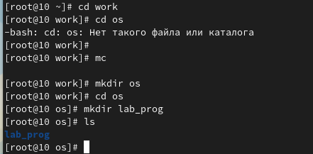
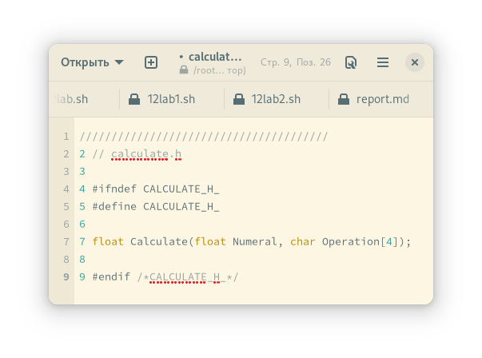
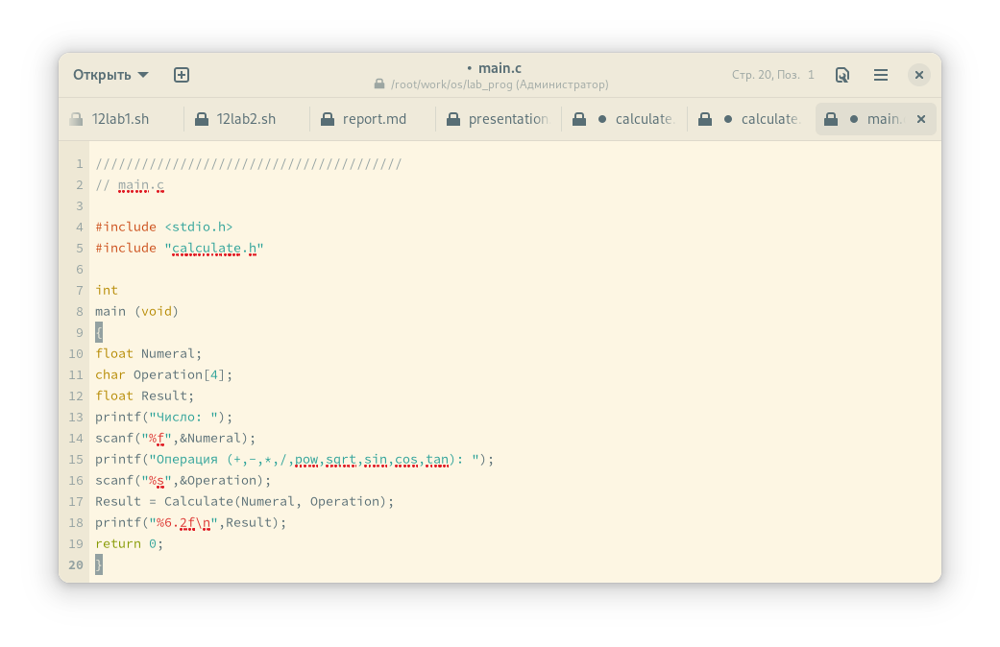

---
## Front matter
title: "Отчёт по лабораторной работе №13"
subtitle: "Средства, применяемые при разработке программного обеспечения в ОС типа UNIX/Linux"
author: "Световидова Полина Михайловна"

## Generic otions
lang: ru-RU
toc-title: "Содержание"

## Bibliography
bibliography: bib/cite.bib
csl: pandoc/csl/gost-r-7-0-5-2008-numeric.csl

## Pdf output format
toc: true # Table of contents
toc-depth: 2
lof: true # List of figures
lot: true # List of tables
fontsize: 12pt
linestretch: 1.5
papersize: a4
documentclass: scrreprt
## I18n polyglossia
polyglossia-lang:
  name: russian
  options:
	- spelling=modern
	- babelshorthands=true
polyglossia-otherlangs:
  name: english
## I18n babel
babel-lang: russian
babel-otherlangs: english
## Fonts
mainfont: PT Serif
romanfont: PT Serif
sansfont: PT Sans
monofont: PT Mono
mainfontoptions: Ligatures=TeX
romanfontoptions: Ligatures=TeX
sansfontoptions: Ligatures=TeX,Scale=MatchLowercase
monofontoptions: Scale=MatchLowercase,Scale=0.9
## Biblatex
biblatex: true
biblio-style: "gost-numeric"
biblatexoptions:
  - parentracker=true
  - backend=biber
  - hyperref=auto
  - language=auto
  - autolang=other*
  - citestyle=gost-numeric
## Pandoc-crossref LaTeX customization
figureTitle: "Рис."
tableTitle: "Таблица"
listingTitle: "Листинг"
lofTitle: "Список иллюстраций"
lotTitle: "Список таблиц"
lolTitle: "Листинги"
## Misc options
indent: true
header-includes:
  - \usepackage{indentfirst}
  - \usepackage{float} # keep figures where there are in the text
  - \floatplacement{figure}{H} # keep figures where there are in the text
---

# Цель работы

Приобрести простейшие навыки разработки, анализа, тестирования и отладки приложений в ОС типа UNIX/Linux на примере создания на языке программирования С калькулятора с простейшими функциями.

# Задание

1. В домашнем каталоге создайте подкаталог ~/work/os/lab_prog.
2. Создайте в нём файлы: calculate.h, calculate.c, main.c.
Это будет примитивнейший калькулятор, способный складывать, вычитать, умножать
и делить, возводить число в степень, брать квадратный корень, вычислять sin, cos, tan.
При запуске он будет запрашивать первое число, операцию, второе число. После этого
программа выведет результат и остановится.
3. Выполните компиляцию программы посредством gcc:
4. При необходимости исправьте синтаксические ошибки.
5. Создайте Makefile со следующим содержанием:
6. С помощью gdb выполните отладку программы calcul (перед использованием gdb
исправьте Makefile):
- Запустите отладчик GDB, загрузив в него программу для отладки
- Для запуска программы внутри отладчика введите команду run:
- Для постраничного (по 9 строк) просмотра исходного код используйте команду list:
- Для просмотра строк с 12 по 15 основного файла используйте list с параметрами:
- Для просмотра определённых строк не основного файла используйте list с параметрами:
- Установите точку останова в файле calculate.c на строке номер 21:
- Выведите информацию об имеющихся в проекте точка останова:
- Запустите программу внутри отладчика и убедитесь, что программа остановится в момент прохождения точки останова:
- Отладчик выдаст следующую информацию:
- Посмотрите, чему равно на этом этапе значение переменной Numeral
На экран должно быть выведено число 5.
- Сравните с результатом вывода на экран после использования команды:
- Уберите точки останова:
7. С помощью утилиты splint попробуйте проанализировать коды файлов calculate.c
и main.c

# Выполнение лабораторной работы

В домашнем каталоге создаю подкаталог ~/work/os/lab_prog.

##

##

Создаю в нём файлы calculate.h, calculate.c и main.c

##

##

Реализация функций калькулятора в файле calculate.h

##

##

Интерфейсный файл calculate.h, описывающий формат вызова функции калькулятора

##

##

Основной файл main.c, реализующий интерфейс пользователя калькулятору

##

##

Далее выполняю компиляцию программы посредством gcc

##

##

Создаю Makefile

##

##

Далее исправляю код для Makefile

##

##

С помощью gdb выполняю отладку программы calcul и запускаю отладчик GDB, загрузив в него программу для отладки. Для запуска ввожу команду run

##

# Выводы

В ходе выполнения лабораторной работы №13 я приобрела простейшие навыки разработки, анализа, тестирования и отладки приложений в ОС типа UNIX/Linux на примере создания на языке программирования С калькулятора с простейшими функциями 
