---
## Front matter
lang: ru-RU
title: Второй этап индивидуального проекта
author: |
	  Световидова Полина НБИбд-04-22\inst{1}

institute: |
	\inst{1}Российский Университет Дружбы Народов

date: 17 марта, 2023, Москва, Россия

## Formatting
mainfont: PT Serif
romanfont: PT Serif
sansfont: PT Sans
monofont: PT Mono
toc: false
slide_level: 2
theme: metropolis
header-includes: 
 - \metroset{progressbar=frametitle,sectionpage=progressbar,numbering=fraction}
 - '\makeatletter'
 - '\beamer@ignorenonframefalse'
 - '\makeatother'
aspectratio: 43
section-titles: true

---

## Цель работы: 

Научиться оформлять сайт, менять информацию о себе и создавать несколько постов.

## Ход работы:

Для начала я должна добавить на свой сайт личную фотографию, делаю это через файлы в папке blog. 

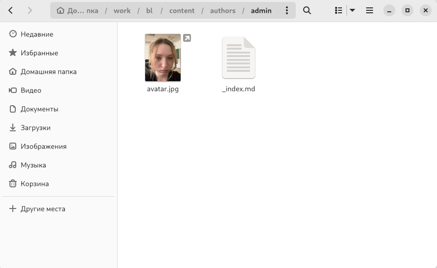

##

Далее мы должны добавить информацию о себе, а именно свое имя, вуз и биографию.

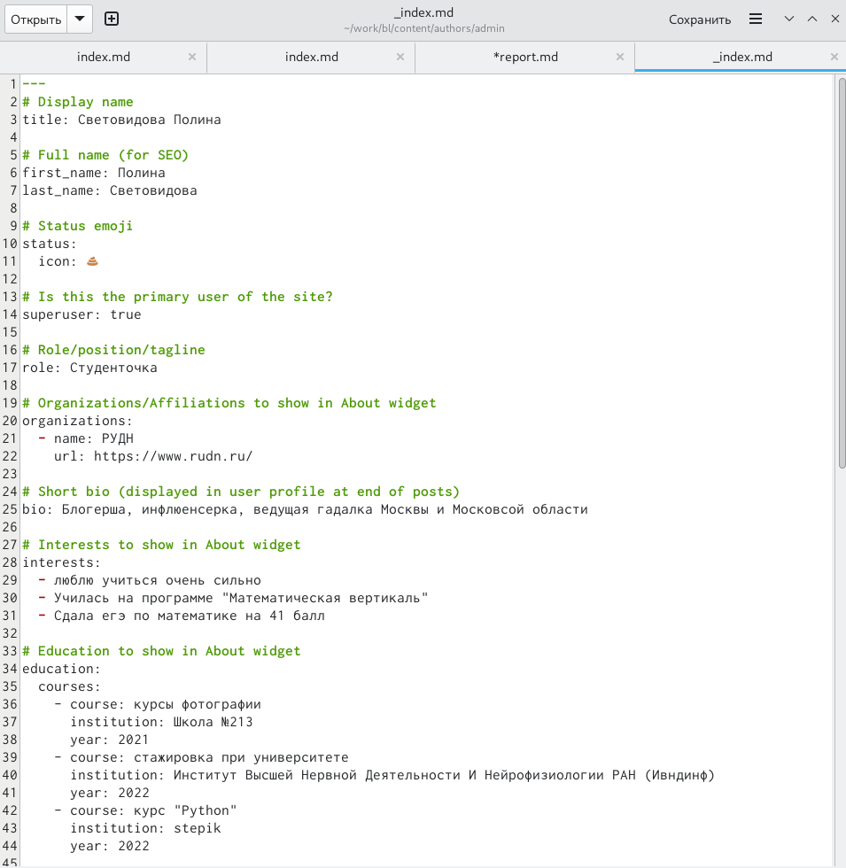 

##

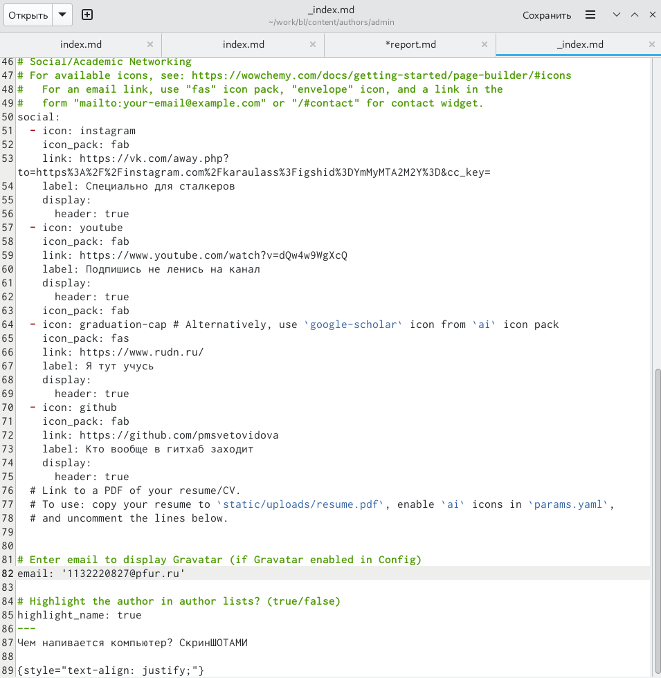 

##

Далее я должна добавить пост по прошедшей неделе

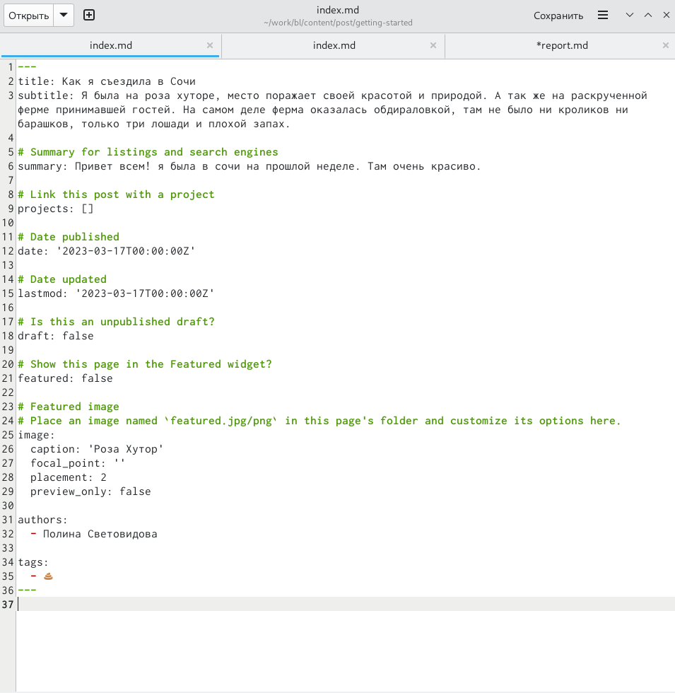 

##

Сам сайт со всеми изменениями я покажу в конце

Также пишу еще один пост на тему по выбору, я выбрала тему-Управление версиями Гит

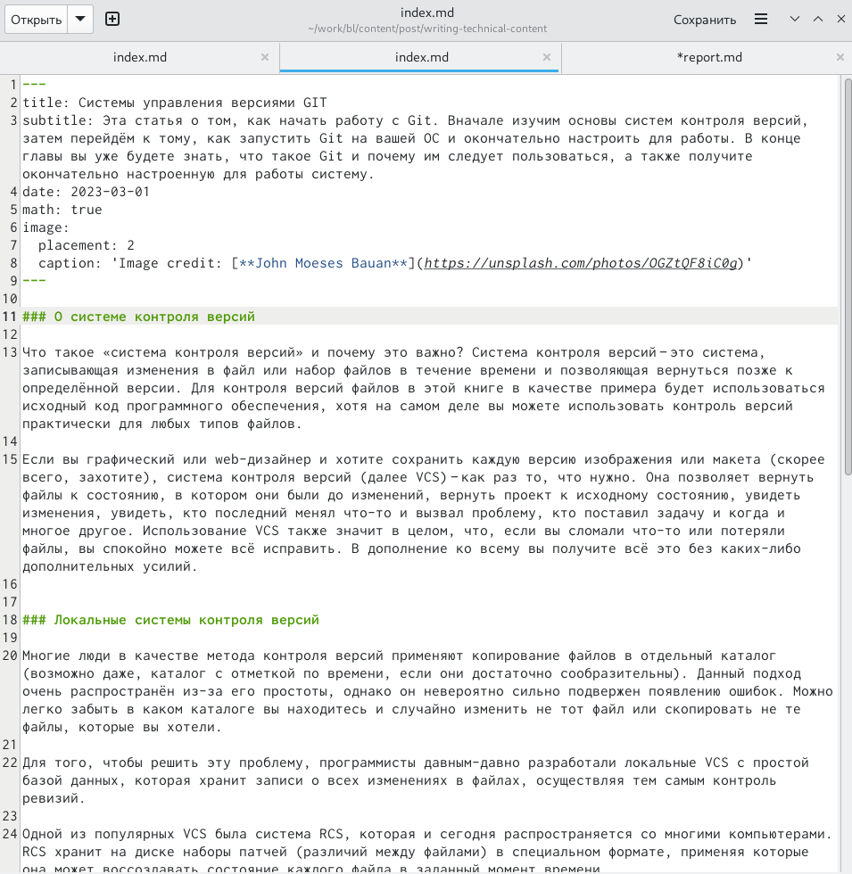 

##

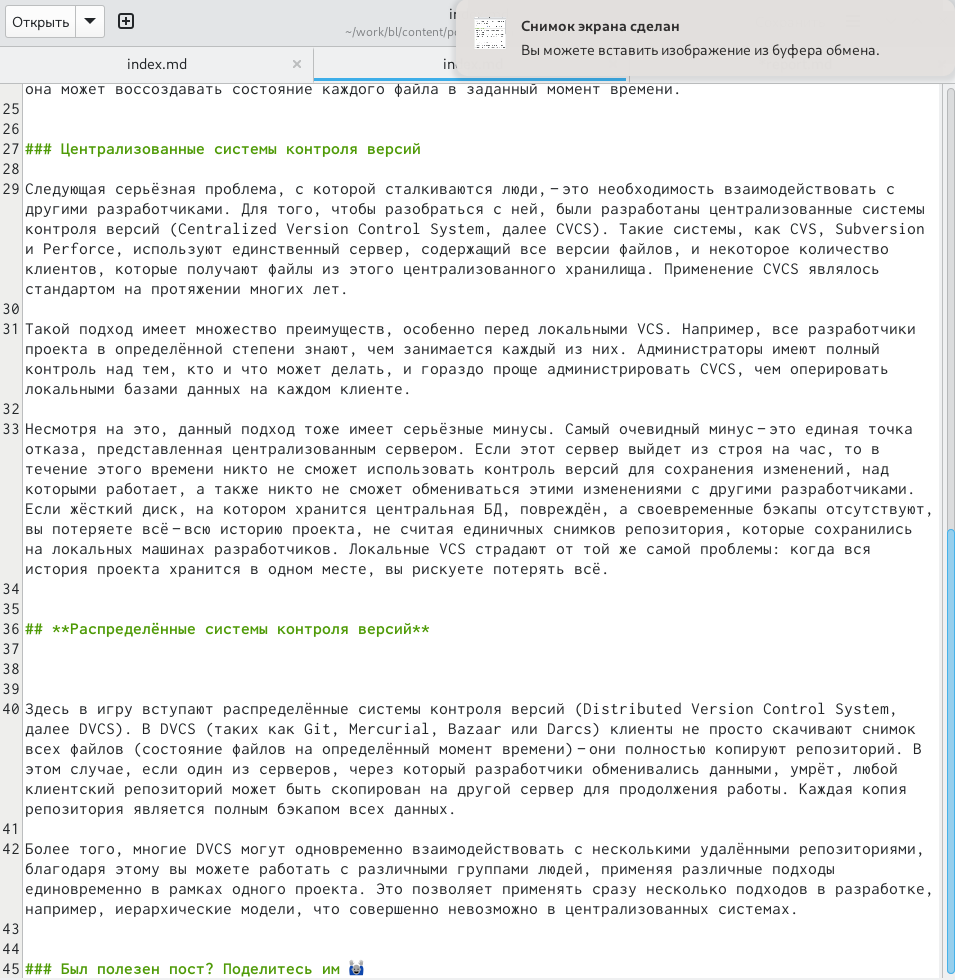 

##

А теперь сам сайт:

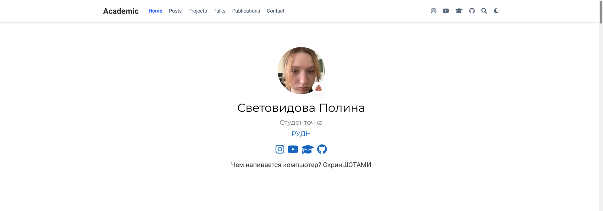

##

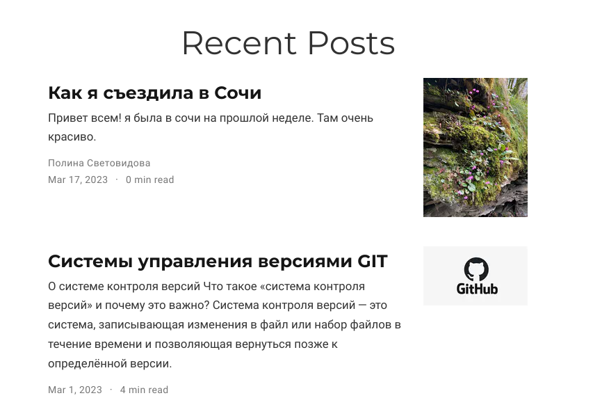 

##

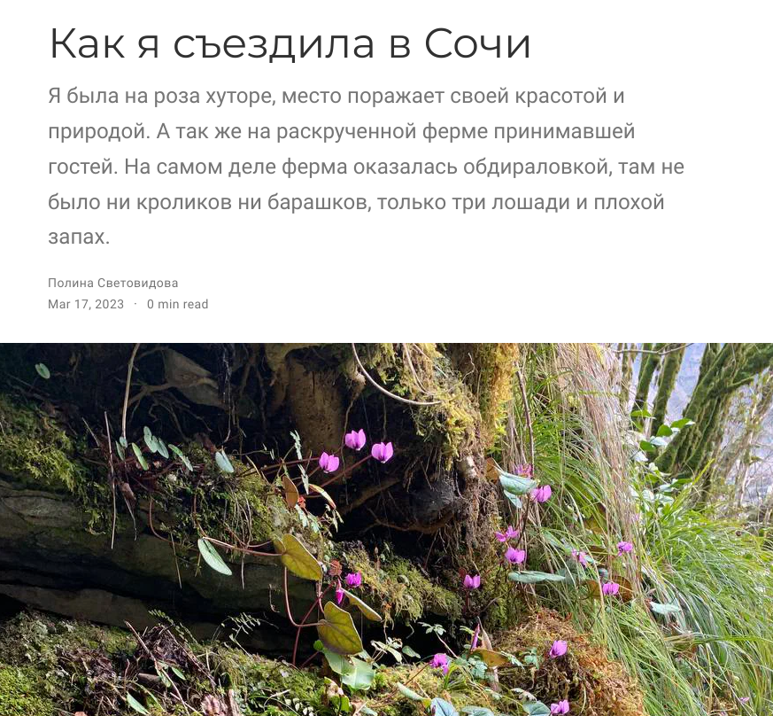 

##

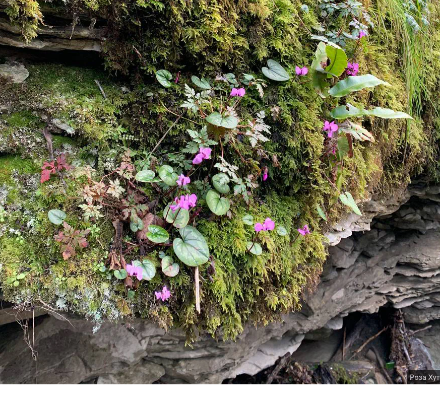

##

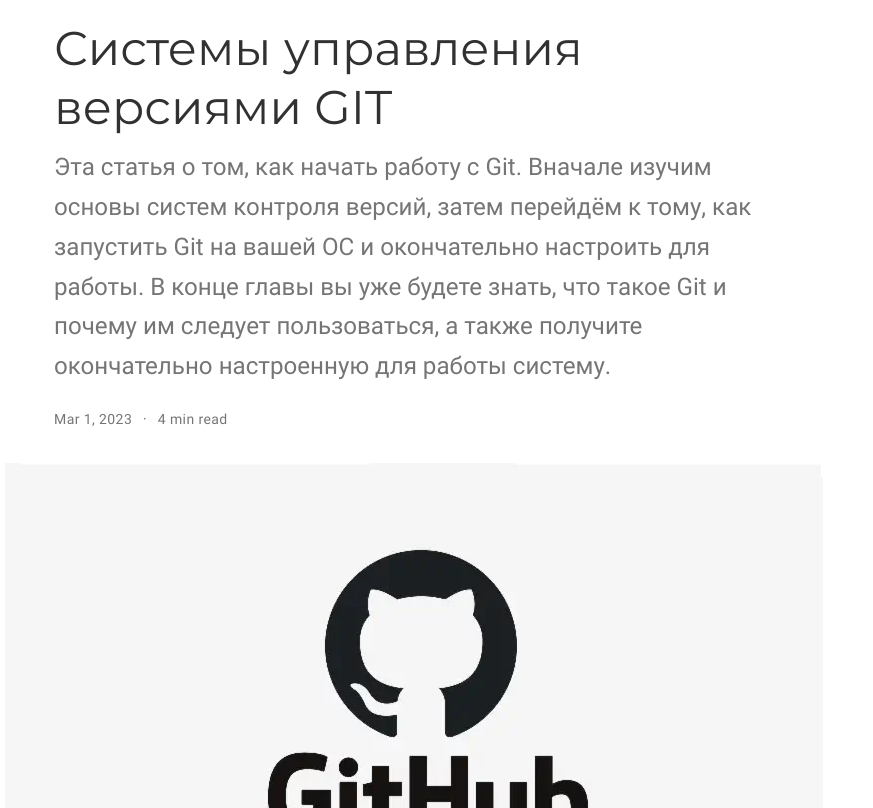

##

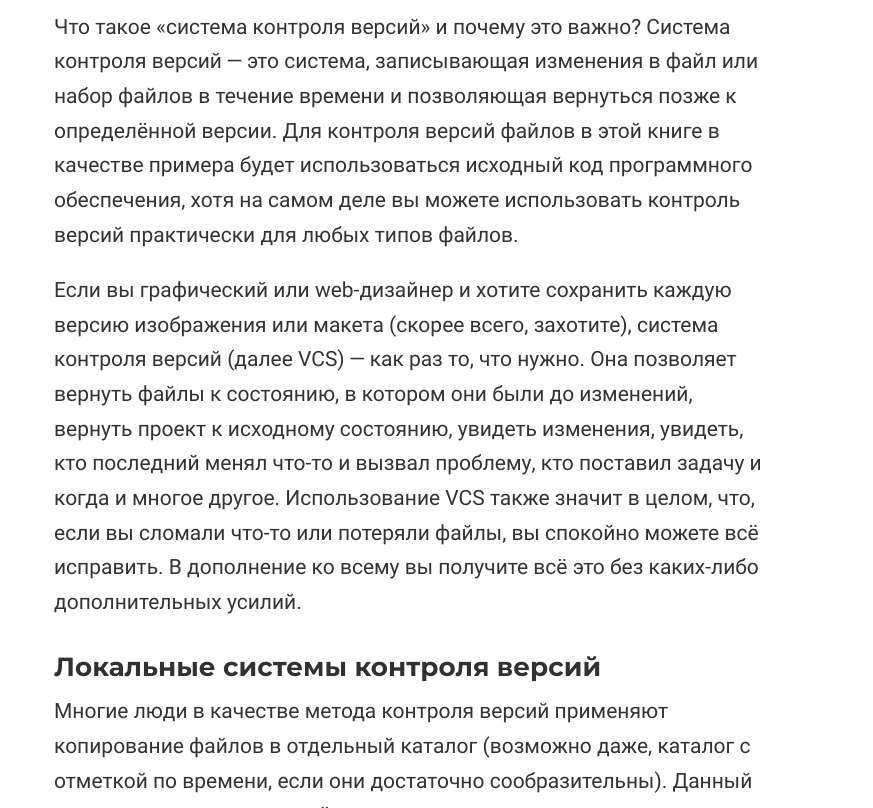
 
##

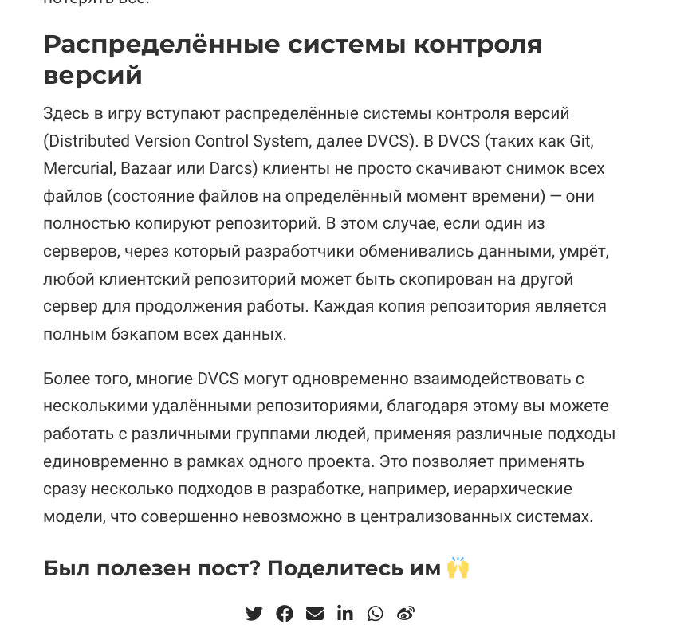

## Вывод:

Я научилась оформлять личный сайт, а также создавать посты.

